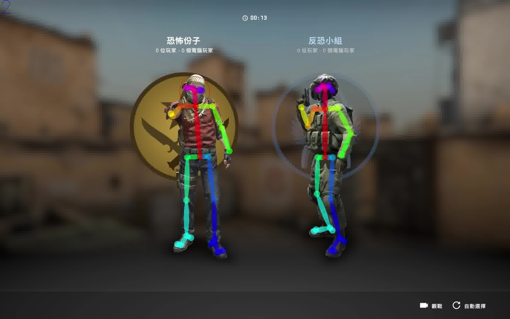
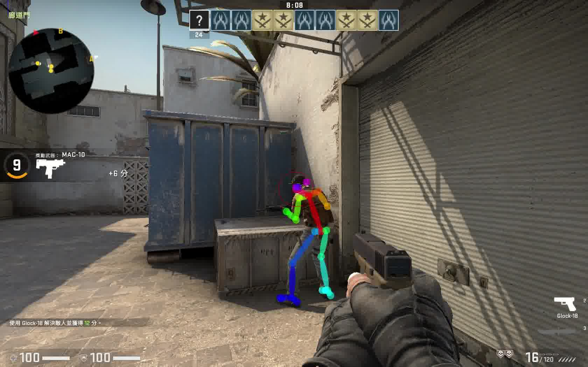
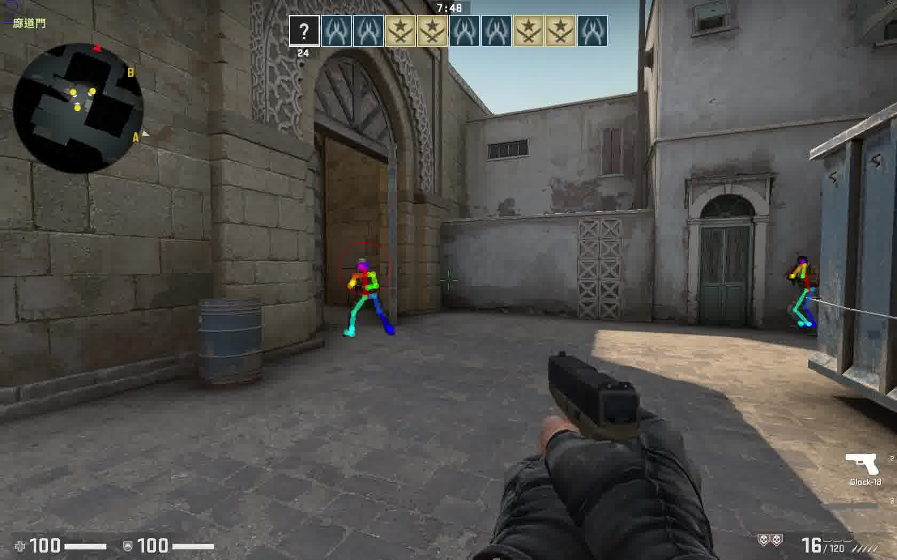

# AI-AimBot
Experimental of implement undetectable aimbot for First-Person-Shooter Games with Neural Network

## Demo
- Test openpose result on CSGO
  
[video](https://www.youtube.com/watch?v=ihi6JS57Cl4&t=29s)







## How to build

### OS
It support on Windwos for now

### Compiler
Visual studio 2017 (But I assume visual studio 2019 still work on this)

### Requirement
- Cmake 3.17 or above
- CUDA & Cudnn
  - My configuration is 10.2 / 8.0.3
  - You can install it follow [openpose suggestion](https://github.com/CMU-Perceptual-Computing-Lab/openpose/blob/master/doc/installation/1_prerequisites.md#windows-prerequisites)

### Build with script
```
cd script
build.bat Release
```

